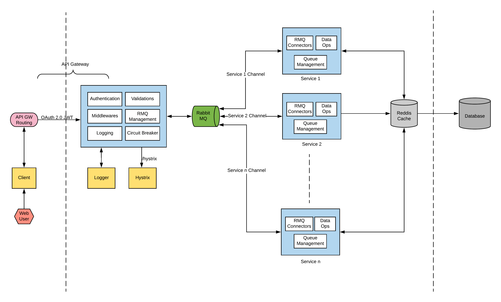

# Playground

Repository for doing POCs

## StyleGuide

Follow [JS Style Guide](https://github.com/airbnb/javascript) while development.

## Concept

Microservices based end to end items delivery application.

## Microservices based architecture

Realtime backend solution is developed using `Nodejs` technology with its most popular framework i-e `ExpressJs`. Web app users connect to the backend using api gateways. RabbitMQ is used for the internal communication between api gateway and the services. API service perform the following major tasks.

- Url Routing
- Validation
- Token based Security Mechanism i-e JWT validation
- Logging
- RMQ Management
- Circuit Breaker

Other services perform the following operations.

- Database Setup
- Event Logging
- Data Operations
- Response API gateway’s request
- Queue Management
- RabbitMQ Health Checks

<p align=center> Architectural diagram is shown below. <p>
  


## Repos cloning and pulling

To clone all repos, download `clone_RDBMSS_repo.sh` in the directory where you want to clone all repos. Then run following command in the terminal to execute the file.

```sh
bash clone_RDBMSS_repo.sh
```

And during your development, if you wish to pull latest changes from all the repos, then download `pull_RDBMSS_repo.sh` in the directory where all repos are there. Then run following command in the terminal to execute the file.

```sh
bash pull_RDBMSS_repo.sh
```

> **Note**: In case you have created any local branch in any repo, then make sure to set an upstream branch for it to get the pull.
