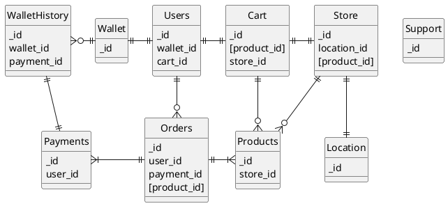

# UML Diagram

```plantuml
@startuml
hide circle

entity Cart {
    _id
    [product_id]
    store_id
}
entity Location {
    _id
}
entity Orders {
    _id
    user_id
    payment_id
    [product_id]
}
entity Payments {
    _id
    user_id
}
entity Products {
    _id
    store_id
}
entity Store {
    _id
    location_id
    [product_id]
}
entity Support {
    _id
}
entity Users {
    _id
    wallet_id
    cart_id
}
entity Wallet {
    _id
}
entity WalletHistory {
    _id
    wallet_id
    payment_id
}

Users ||-left-|| Wallet
Users ||-right-|| Cart
Users ||--o{ Orders
Orders ||-right-|{ Products
Orders ||-left-|{ Payments
WalletHistory }o-right-|| Wallet
WalletHistory ||--|| Payments
Cart ||--o{ Products
Cart ||-right-|| Store
Store ||--|| Location
Store ||--o{ Products

@enduml
```
